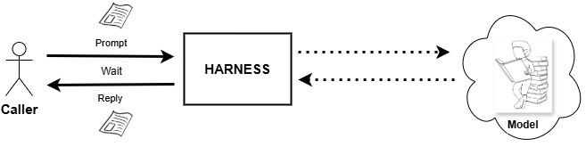

# AI Primer 

[The architects' view of the AI world](#theoria-mundi-de-architectorum).

## Model, LLM, Instance, Harness


(that is just an caricature)

- **AI** : Artificial Intelligence. Has no single simple, universally accepted definition. Unfortunately marketing industrial complex has produced enough false definitions for public to be manipulated into believing AI is what marketing says it is. The best I can offer is this: `AI is not a technology`. And the next best I can do beside that is to ask avid readers to visit [Britannica on line suite](https://www.britannica.com/technology/artificial-intelligence), devoted to the subject. Where I did learnt, AI is far from being just a technology.

Further down the road, there are 3 key [abstractions](#abstraction).

- **Model**: An abstract computational structure — architecture plus learned parameters — that maps input to output.
- **LLM**: A Model subclass constrained to transformer-based architectures, trained on huge piles of text.
- **Sonnet5**: A concrete LLM instance — Anthropic's specific trained checkpoint with fixed weights, currently answering you.

Presented as an object oriented inheritance chain

```c
Model (abstract)
  └── LLM : Model        // transformer, trained on text
        └── Sonnet5 : LLM // example, concrete: specific weights, specific release
```
 That is a simple, effective explanation of what AI actually amounts to in 2026.

 <div style="page-break-after: always;"></div>

## The Harness



>
> &nbsp;
> 
> Harness is just a communication end point you use  to chat with the Model. For example `Sonnet 5`.
>Example of a manifestation of a harness on a windows desktop is `claude.exe`. An normal Windows CLI program.
>
> &nbsp;
> 

"Harness" is the term used in agentic-AI circles for the scaffolding around a view onto the model. In reality harness is the program containing tool-calling loop, permission system, context management. Operator using harness program (example `claude.exe` on Windows), experiences an LLM as an agent that can act. Claude Code is Anthropic's harness for Claude: it wraps the model calling with file/bash/edit tools, a loop, and [guardrails](#guardrails).

Claude Code, Cowork,etc. are example harnesses, the programs around the remote model calls. The local desktop tools are given to it (file editing, bash, browser, etc.); as well as how much memory/[context](#context) it keeps, and what actions it's allowed to take, on your desktop.

User (You) experienced behavior of the harness is dictated also by this fact: the **model** it references is stateless. Everything humans experience as "agent [paraphernalia](#paraphernalia)" (memory, tool use, multi-turn state) comes from the harness in need of orchestrating repeated calls to that stateless model, not from the model itself. 

<div style="page-break-after: always;"></div>

# Vocabulary

### [Theoria mundi de architectorum](readme.md#theoria-mundi-de-architectorum)

### Abstraction

A name for what a thing does, with the details of how it does it left out.

### Context

The text sent with prompt, to the stateless model on each call. The harness assembles it. Stateless means, the model has no memory of anything outside the context. It answers the prompt, sends the response back. Forgets if has ever happened.

### Guardrails

Are the limits on the harness program's activity. The human user experiences them as limits on what the model is allowed to do.

### Paraphernalia

The assorted gear that comes with an activity, not the activity itself.

### Category

See (for example) [DBJ Taxonomy](https://method.dbj.org/taxonomy_core.html) for an immediate usage in the context of IT supported commercial organization.

---

(c) 2026 by dbj@dbj.org | MIT License