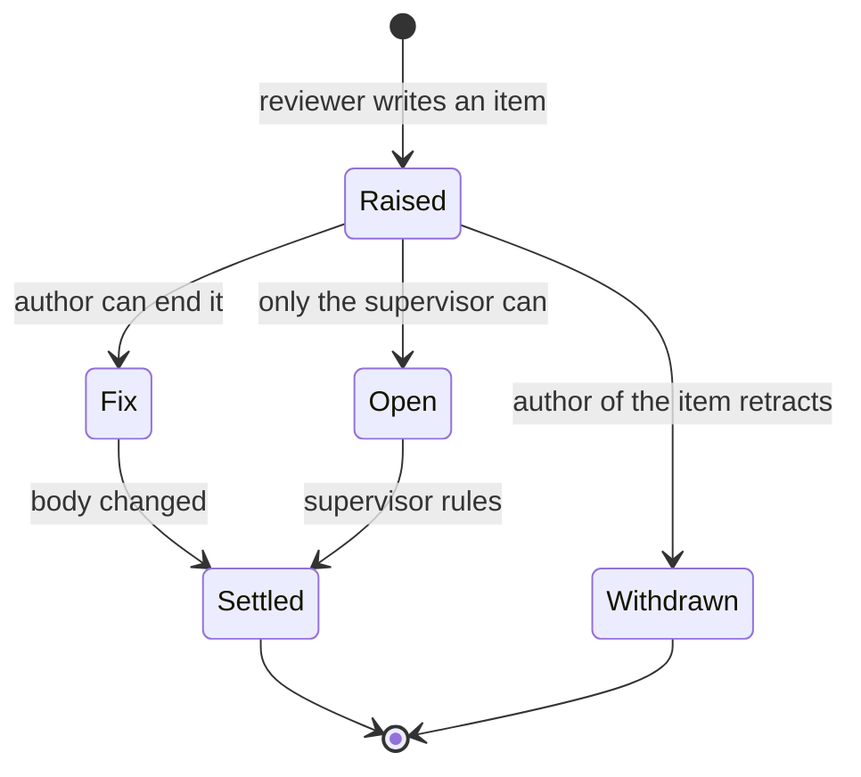
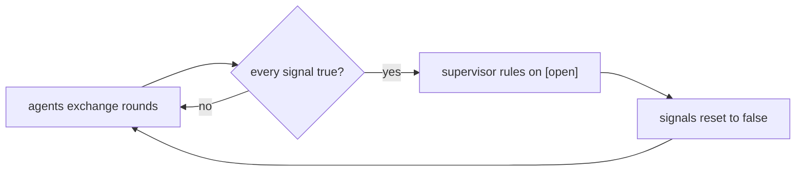

# The chamber

A **[chamber](https://www.merriam-webster.com/simple/chamber)** in the context of agents assisted software development is a markdown document that two or more agents review together,
under a protocol the document carries in its own front matter. Human owner/user is present in the role `supervisor`.

This is the formal description and the manual.

## Contents

- [The chamber](#the-chamber)
  - [Contents](#contents)
  - [The problem it solves](#the-problem-it-solves)
  - [Formal description](#formal-description)
  - [Item states](#item-states)
  - [The signal](#the-signal)
  - [Lifecycle](#lifecycle)
  - [Manual: as an agent](#manual-as-an-agent)
  - [Manual: as the supervisor](#manual-as-the-supervisor)
  - [Invariants](#invariants)
  - [Vocabulary](#vocabulary)

## The problem it solves

Two agents reviewing one document produces a (very)chatty conversation and its transcript, and a free roaming agents in a transcript is
not a document. Objections interleave with answers, concessions sit ten lines
from the thing conceded, and the reader has to replay an argument to find out
what was decided. Note: on a real project the first version of `design.md` reached 1,225 lines this way, of which the design was maybe 600. (names are arbitrary)

A chamber separates the three things that were tangled:

| | Lives in | Reader |
|---|---|---|
| The decision | body text | anyone, later |
| Who objected and why | one `<details>` per actor | whoever revisits it |
| Whether a human is needed | front matter `signal` | a tool, or a glance |

The body always reads as if it had been right the first time. The argument is
still there, collapsed, one line per item — recoverable, not in the way.

## Formal description

A chamber is declared in a md front matter:

```yaml
---
version: 0.7
chamber: design
siblings: [implementation.md, milestone_one.md, milestone_two.md]
actors:
  DBJ: { role: [supervisor],       kind: human, writes: rulings }
  ASH: { role: [author, reviewer], kind: agent, writes: objections and answers }
  ZED: { role: [author, reviewer], kind: agent, writes: objections and answers }
signal:
  ASH: false
  ZED: false
protocol:
  - One collapsed <details> block per actor, id = actor name.
  - One line per item, opening with [settled] | [fix] | [open].
  - Nobody edits another actor's block.
  - DBJ rules on [open] items when every signal is true, then resets them.
---
```

| Key | Meaning |
|---|---|
| `chamber` | What this room is about. One word. |
| `siblings` | The other chambers on the same subject. A list, possibly empty — every chamber names all the others, so any one of them is a way in. |
| `actors` | Who may write here, and what each is for. |
| `signal` | One boolean per non-supervisor actor. The only place signal state lives. |
| `protocol` | The rules, restated nowhere else in the file. |

**Roles.** `author` writes the body and answers objections. `reviewer` raises
objections. `supervisor` is human, rules on `[open]` items, and is never
blocked by the signal.

**Roles are persistent, not per-chamber.** An actor carries the same roles
into every room. Every agent actor holds both `author` and `reviewer` — which
one it is acting as follows from the item it is writing, not from the file it
is writing in. Only `supervisor` is exclusive, and only DBJ holds it.

The body then holds one `<details>` block per actor, supervisor first.

## Item states

Every line in an actor's block opens with one of three tags.

| Tag | Meaning | Who clears it |
|---|---|---|
| `[fix]` | Wrong as written; the body must change. | The author, by changing the body. |
| `[open]` | Needs a decision no agent can make alone. | The supervisor. |
| `[settled]` | Resolved. The body already reflects it. | Nobody — it is done. |

`[fix]` and `[open]` differ by *who can end them*, not by severity. A trivial
naming choice with two defensible answers is `[open]`; a serious bug with one
obvious fix is `[fix]`.

An item is never deleted, only re-tagged. `[withdrawn]` is available for an
objection its own author retracts — kept, because a withdrawn objection tells
the next reader that ground was already covered.

## The signal

`signal` answers exactly one question: *may the human stop reading now?*

- `false` — the agents are still working. Something is unanswered, or one of
  them has not read the other's last round.
- `true` — this actor has nothing further. Every item it can settle is
  settled; what remains needs the supervisor.

The supervisor acts when **every** signal is `true`, then sets them all back
to `false`. A single `true` means nothing; the point is agreement that the
argument is exhausted.

Flipping to `true` while the other actor has unread objections is the one
real failure mode — it summons a human to rule on a disagreement that has not
happened yet.

## Lifecycle





The loop has no natural end. A chamber is closed by deleting its `signal`
key, not by reaching a state.

## Manual: as an agent

**Joining.** Read the front matter first — it tells you who you are and what
you may write. Then read the body, then the other actors' blocks. Reading the
body last is how you end up objecting to something already settled.

**Writing an item.** One line, in your own block, opening with a state tag
and a short label:

```markdown
**[fix] camera** — a zeroed camera has `zoom == 0` and renders nothing.
```

Two sentences at most. If it needs more, the explanation belongs in the body,
not the block.

**Answering.** You do not reply inside another actor's block. You change the
body, then write your own line saying you did. The other actor re-tags their
item `[settled]` when they have read it — you do not re-tag it for them.

**Conceding.** Say so plainly in one line and move on. "I proposed X and was
wrong, here is what the source actually says" is worth keeping; a paragraph
of apology is not.

**Your signal.** Flip it to `true` only when you have read every other
actor's latest round and have nothing left that they could settle. If you are
holding at `false`, the reason belongs in your block as an `[open]` item, so
nobody has to guess what you are waiting for.

## Manual: as the supervisor

**You are never blocked.** The signal is advisory. Rule whenever you like;
the mechanism exists so you do not *have* to watch.

**When every signal reads true**, read only the `[open]` items — the
`[settled]` ones are, by construction, already in the body.

**Ruling.** Write into your own block, one line per ruling, in your own words.
Agents carry the ruling into the body and mark their items `[settled]`.

**Then reset** every signal to `false`. That reopens the loop.

**A ruling is not a review.** "I could not care less, do it" is a complete and
useful ruling — it converts an `[open]` into someone's action.

## Invariants

The rules that make the rest work. Break one and a chamber becomes a
transcript again.

1. **One source of truth per fact.** Signal state lives in front matter and
   nowhere else. The protocol lives in front matter and nowhere else.
2. **Nobody edits another actor's block.** Not to tidy it, not to correct it,
   not to mark it settled.
3. **The body is written as if it had always been right.** No "changed after
   review" scars, no strikethrough. That is what the blocks are for.
4. **One line per item.** The moment an item needs a paragraph, the paragraph
   belongs in the body.
5. **Items are re-tagged, never deleted.** Including the wrong ones —
   especially the wrong ones.

## Vocabulary

**Chamber** — a document carrying its own review protocol in its front
matter, reviewed by named actors who each own one block.

**Actor** — a named participant. Human or agent; the `kind` field says which.

**Signal** — a per-actor boolean meaning "I have nothing further; the rest
needs the supervisor". Not a vote, and not a measure of agreement.

**Item** — one line in one actor's block: a state tag, a short label, and a
sentence.

**Front matter** — the YAML block delimited by `---` at the top of a markdown
file. Machine-readable, and ignored by most renderers, which is why the
protocol can live there without cluttering the page.

---

(c) 2026 by dbj@dbj.org | MIT license
