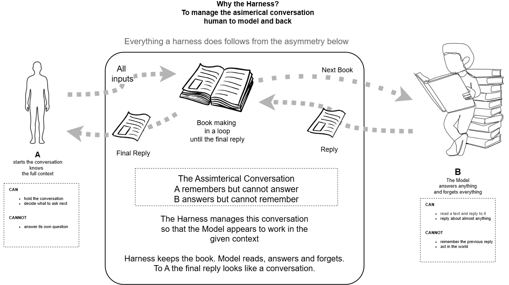
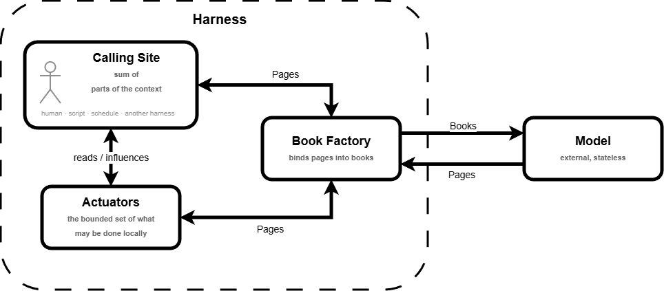

# The Harness — a Primer

| Layer | Question | Who works here |
|---|---|---|
| [Conceptual](#1-the-harness-concept) | WHY does a harness need to exist? | architects and stakeholders |
| [Logical](#2-logical-architecture) | WHAT it is, after we decided why it is | product owners, business analysts |
| [Physical](#3-physical-harness-app-architecture) | HOW is one built? | engineers |

See [Vocabulary](#vocabulary) for terms.

---

## 1. The Harness Concept

**WHY does a harness need to exist?**

The harness concept is the ATM concept. A very simple interface — a slot, a few buttons — in front
of machinery the customer never sees and never needs to: accounts, ledgers, networks, clearing.
One institution, many customers, each served as if alone. The simplicity at the front is not the
absence of complexity behind it; it is what the whole arrangement is *for*.

A harness dispenses replies from the model the way an ATM dispenses cash from the bank.

The model is a single global machine answering general purpose questions for very many callers at
once. To do that it must be **stateless**: holding conversation state for hundreds of millions of
simultaneous conversations is not feasible. It reads a text, replies with a text, and forgets.

The caller wants the opposite of that. A conversation. Something that remembers what was already
said, and is therefore worth their time.

That gap is why the harness exists. It is the **communication dispatcher between the many callers
and the one model** — the part that lets a caller experience an ordinary, business valuable
conversation with a machine that has no memory.

Two units carry the traffic:

**Page** — a single prompt, or a single text describing some part of the context. What the caller
sends, and what the model replies with.

**Book** — pages bound together: the full conversation context, and the original prompt. Books are
what the harness sends to the model, and only the harness makes them.

The asymmetry is the whole point: **the caller deals in pages, the model is handed books.** Each
reply that arrives becomes part of the next book, which is sent again. That repeats until a reply
carries nothing needing another round, and the caller receives one page — the final reply.

---

## 2. Logical Architecture 

**WHAT it is, after we decided why it is.**

> Architecture is the formal description of a system *and its parts*.

The Harness has three parts. The Model is not one of them — it is external, and only one part ever
speaks to it.

### Calling Site

The sum of parts of the context. Every source that contributes something the Model may need: the
prompt itself, the files on disk, the instructions, whatever happened last time. It is also where
the final reply arrives.

A human is one such source. So is a script, a schedule, another Harness. None of them is privileged
— which is precisely what makes automation possible: replace the human with a cron entry and
nothing else in this picture changes.

### Book Factory

Binds pages into books, sends them, and reads what comes back.

This is the only part that touches the Model, and the only part that holds anything. It exists
because the Model is stateless: the conversation has to be assembled by somebody, on every single
call, from scratch.

One responsibility lands here that nobody assigned: **deciding when to stop**. The Calling Site is
not watching. The Model does not know it is being called repeatedly. So the Book Factory judges each
reply and decides whether there is another book to make — a decision taken on assumptions, by the
one part that was never told what "finished" means.

### Actuators

The bounded set of what may be done locally. See [Vocabulary](#vocabulary) for where the term comes
from.

The Model produces text and text alone, and a conversation that changes nothing is not work. The
Actuators are what converts a decision into an effect: write the file, run the command, fetch the
page. They read the Calling Site and they change it.

Note **bounded**. The effects are real, so the set is chosen in advance rather than left open. And
whatever an Actuator does, it reports back as a page — text being the only thing that can go into
the next book.

### Model — external

Reads the book, returns a page, forgets. Nothing else. It cannot act, it holds nothing, and it does
not know it is in a loop.

---

## 3. Physical Harness App Architecture

**HOW is one built?**

The base of the diagram above is the widely circulated one. It is included because it is what people have seen, and it needs caveats, because it was drawn without a conceptual or logical layer before it.

### Caveats on the original

1. **"Claude Code CLI is the Harness."** No. It is *an implementation* of a harness. The harness
   is the concept; this is one product realising it. Others exist and more will.

2. **"Turning a model into an agent."** Marketing. The model is unchanged throughout. What is
   assembled is a conversation loop around it.

3. **"Agent behavior (emergent)."** Nothing in the application implements *being an agent*. The
   model emits text, the app dispatches and feeds results back. Run that loop enough times and it
   resembles something working on a task. "Emergent" is a real term doing promotional work here —
   it dresses up a while-loop.

4. **The model is drawn inside the machine.** It is not. It is a remote endpoint. Inside the
   application there is only a call to it and a wait for the reply.

5. **Tools appear to be parts of the application.** They are not. They are call sites. The app
   shells out to programs already installed on the desktop — bash, an editor, a browser — and
   reads back their output. No tool lives inside the app.

6. **The illustration implies engineering.** Gears, pistons, linkages. The actual mechanism is a
   loop over a text protocol.

### What the physical layer actually contains

Read left to right, the honest version of the same diagram:

1. **Context assembly** — builds the payload for every turn: user prompt, `CLAUDE.md` files,
   `memory/*.md`, conversation so far, previous tool results, tool schemas. Concatenated into one
   text blob. Repeated in full each turn, because the model is stateless. (This component has no
   official name; the label is descriptive.)

2. **Remote call** — sends that payload to the model endpoint and waits.

3. **Reply parser** — reads the returned text. It may contain a structured `tool_use` block naming
   a tool and its arguments. The model never calls anything; it emits a name. The parser looks that
   name up in the application's dispatch table.

4. **The decision** — `tool_use` present? If yes, the loop continues. If no, the loop exits and the
   reply is the answer. Note the assumption buried here: *absence of a tool_use block means done*.
   That is the application deciding, not the model saying so.

5. **Guardrails / permission system** — the boundary of what may be executed, and the point where a
   human can refuse. This is the accountability requirement from the conceptual layer, made real.

6. **Tool call loop** — dispatch to external programs, collect stdout, exit codes, file contents.
   All of it text, appended to the payload for the next turn.

The tool names and their parameter schemas were sent to the model in the payload. That is how the
model knows which names exist. There is no magic in the arrangement — only a text protocol,
a dispatch table, and a loop.

---

## Vocabulary

**Actuator** — in control engineering, the part of a system that converts a signal into a physical
effect: motors, valves, relays, solenoids. The standard pairing is **sensors** carrying the world
into the system and **actuators** carrying the system's decisions back out; everything between them
is computation. Borrowed here for the same reason: the model decides, and something else has to
move.

**Harness** — the interlocutor that keeps the conversation state on behalf of a stateless model,
and turns its replies into effects. A concept, not a product.

**Stateless** — retains nothing between calls. Every request to the model must carry the entire
context it needs.

**Context / payload** — the full text sent to the model on a single call. Instructions, known
material, tool schemas, conversation history, prior results, and the new input.

**tool_use** — a structured block the model may emit inside its reply, naming a tool and its
arguments. The model emits it; the harness executes it.

**Tool schema** — the machine-readable description of a tool's name and parameters, sent to the
model so it knows what it may ask for.

**Guardrails / permission system** — the mechanism deciding which requested effects are allowed,
and where a human may intervene.

**Emergent** — used in the original diagram to mean "agent-like behaviour that no single component
implements". Accurate in the narrow sense, promotional in effect.

**Conceptual / Logical / Physical** — the [DBJ Taxonomy](https://method.dbj.org/taxonomy_core.html)
layers used to structure this document: why, what, and how.

---

(c) 2026 by dbj@dbj.org | MIT license
