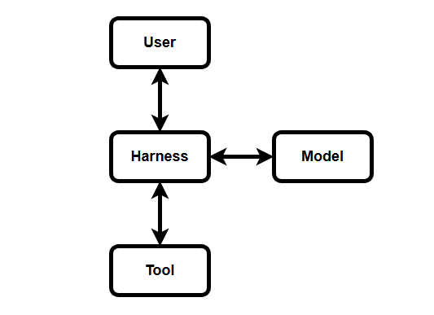
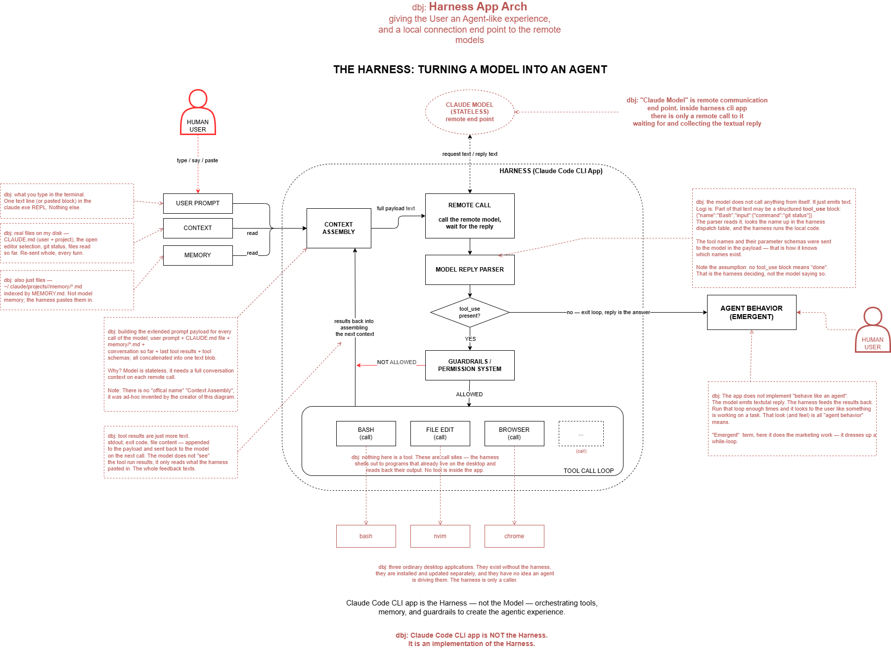

# The Harness — a Primer

The word "harness" is used constantly and defined rarely. This primer defines it across three
architecture layers, in that order, because the usual explanations start at the last one and
therefore explain nothing.

| Layer | Question | Who works here |
|---|---|---|
| [Conceptual](#1-conceptual-harness) | WHY does a harness need to exist? | architects |
| [Logical](#2-logical-harness) | WHAT does it consist of? | product owners, business analysts |
| [Physical](#3-physical-harness-app-architecture) | HOW is one built? | engineers |

See [Vocabulary](#vocabulary) for terms.

---

## 1. The Harness Concept

**WHY does a harness need to exist?**

[Conceptual: the asymmetrical conversation](../diagrams/harness-conceptual-human-model-conversation.drawio)

A Large Language Model is a chat interlocutor with one defect: it forgets everything the moment it has replied. It is not a service you call and not a program you run. It is a correspondent — omniscient, and amnesiac.

That produces an asymmetry between the two parties:

- **A** starts the conversation, knows the full context, remembers everything — and cannot answer.
- **B** answers anything — and cannot remember.

Neither can do the work alone. And because B remembers nothing, A cannot send a message. A must
send **the whole conversation, every time**: who B is meant to be, what is known, what has been
said so far, what happened last time, and only then the new question. Not a page. A book. One page
longer at every exchange.

**That is the harness: the interlocutor who keeps the book.**

Everything else follows. The harness manages the asymmetrical conversation so that the model
*appears* to work on a task. The appearance is the product. Neither party is working in any
ordinary sense — but the exchange, run in a loop until a final reply, looks like work and is
useful like work.

Note what this layer does *not* contain: no application, no tools, no loop mechanics, no vendor.
Those are answers to later questions. If a "harness" explanation begins with tool calls, it has
skipped the reason the thing exists.

---

## 2. Logical Harness

**WHAT does it consist of?**

Within the boundary set by the concept, four roles appear:

| Role | Responsibility |
|---|---|
| **User** | sets the task, judges the result, can refuse |
| **Harness** | keeps the book, drives the exchange, carries out what comes back |
| **Model** | reads the book, returns a reply |
| **Tool** | changes something, or reports something, in the real world |

The harness is the only role connected to all others. That is the whole of the logical claim: it
sits in the middle because the other three cannot reach each other.

**Tool** enters here and not at the conceptual layer, for a reason worth stating. Conceptually the
model only replies. Logically we require effects — a file written, a command run, a page fetched —
because a conversation that changes nothing is not work. The tool role exists to give the
conversation consequences.

This is the layer where product owners work. It says what capabilities must be solved without
saying how: *the harness must persist context*, *the harness must mediate every effect*, *the user
must be able to refuse*. Business analysts concretise it further — workflow diagrams showing where
this sits in an operating model, capability maps, non-functional requirements. Still no code.

---

## 3. Physical Harness App Architecture

**HOW is one built?**

The base of the diagram above is the widely circulated one. It is included because it is what people have seen, and it needs caveats, because it was drawn without a conceptual or logical layer before it.

### Caveats on the original

1. **"Claude Code CLI is the Harness."** No. It is *an implementation* of a harness. The harness
   is the concept; this is one product realising it. Others exist and more will.

2. **"Turning a model into an agent."** Marketing. The model is unchanged throughout. What is
   assembled is a conversation loop around it.

3. **"Agent behavior (emergent)."** Nothing in the application implements *being an agent*. The
   model emits text, the app dispatches and feeds results back. Run that loop enough times and it
   resembles something working on a task. "Emergent" is a real term doing promotional work here —
   it dresses up a while-loop.

4. **The model is drawn inside the machine.** It is not. It is a remote endpoint. Inside the
   application there is only a call to it and a wait for the reply.

5. **Tools appear to be parts of the application.** They are not. They are call sites. The app
   shells out to programs already installed on the desktop — bash, an editor, a browser — and
   reads back their output. No tool lives inside the app.

6. **The illustration implies engineering.** Gears, pistons, linkages. The actual mechanism is a
   loop over a text protocol.

### What the physical layer actually contains

Read left to right, the honest version of the same diagram:

1. **Context assembly** — builds the payload for every turn: user prompt, `CLAUDE.md` files,
   `memory/*.md`, conversation so far, previous tool results, tool schemas. Concatenated into one
   text blob. Repeated in full each turn, because the model is stateless. (This component has no
   official name; the label is descriptive.)

2. **Remote call** — sends that payload to the model endpoint and waits.

3. **Reply parser** — reads the returned text. It may contain a structured `tool_use` block naming
   a tool and its arguments. The model never calls anything; it emits a name. The parser looks that
   name up in the application's dispatch table.

4. **The decision** — `tool_use` present? If yes, the loop continues. If no, the loop exits and the
   reply is the answer. Note the assumption buried here: *absence of a tool_use block means done*.
   That is the application deciding, not the model saying so.

5. **Guardrails / permission system** — the boundary of what may be executed, and the point where a
   human can refuse. This is the accountability requirement from the conceptual layer, made real.

6. **Tool call loop** — dispatch to external programs, collect stdout, exit codes, file contents.
   All of it text, appended to the payload for the next turn.

The tool names and their parameter schemas were sent to the model in the payload. That is how the
model knows which names exist. There is no magic in the arrangement — only a text protocol,
a dispatch table, and a loop.

---

## Vocabulary

**Harness** — the interlocutor that keeps the conversation state on behalf of a stateless model,
and turns its replies into effects. A concept, not a product.

**Stateless** — retains nothing between calls. Every request to the model must carry the entire
context it needs.

**Context / payload** — the full text sent to the model on a single call. Instructions, known
material, tool schemas, conversation history, prior results, and the new input.

**tool_use** — a structured block the model may emit inside its reply, naming a tool and its
arguments. The model emits it; the harness executes it.

**Tool schema** — the machine-readable description of a tool's name and parameters, sent to the
model so it knows what it may ask for.

**Guardrails / permission system** — the mechanism deciding which requested effects are allowed,
and where a human may intervene.

**Emergent** — used in the original diagram to mean "agent-like behaviour that no single component
implements". Accurate in the narrow sense, promotional in effect.

**Conceptual / Logical / Physical** — the [DBJ Taxonomy](https://method.dbj.org/taxonomy_core.html)
layers used to structure this document: why, what, and how.

---

(c) 2026 by dbj@dbj.org | MIT license
