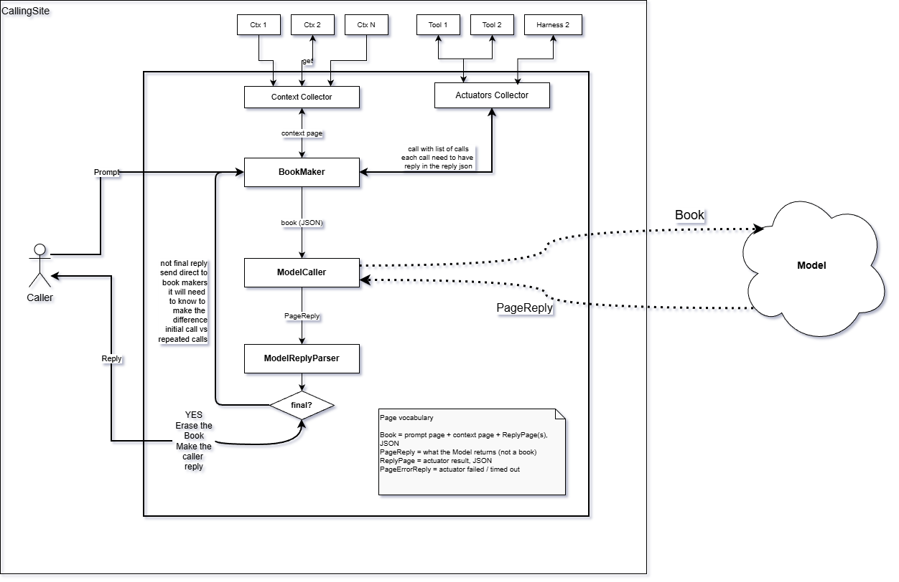

## Conceptual view: Why Harness


**To emulate normal conversation with Model. From Callers point of View**

## Logical View: What is the harness

### Why the Book

By using the "Book" Concept, Model receives the full conversation context with each request.


Book = Full Calling Site Context + Original Prompt

### Harness Logic


Harness "duties"

1. Communication to/from the Caller
2. Communication fo/from the Model
3. Actuators communication to tools available in the calling site and other harnesses available in the calling site
4. Collection the context from the calling site

## Physical View: Harness and the Runtime Environment



The Harness is a process running on the calling site. The calling site is a
directory plus the host OS around it. The Model is remote and stateless.

### The protocol

Caller to Harness is the same protocol as Harness to Model: send prompt, wait,
receive reply text. One Caller in flight, one Book.

### Page

Page is an abstraction with several roles in this protocol.

1. class Page
   1. subclass PageReply
      1. subclass PageErrorReply

That is logical view, it will be implemented as JSON. To travel with textual replies.

### Book

The Book is a single JSON file, held locally on the calling site.

- original prompt page on top
- pages produced by the Context Collector
- pages produced by the Actuators Collector
- PageReply from the Model, when this is not the first visit to the BookMaker

The BookMaker has two kinds of input, the Caller prompt and a Model PageReply,
so it must know who called. On each run the context is collected again; no
original context is kept. The Book is added to until the final reply is
returned, at which point it is erased.

### Context Collector

Lives in the Harness process and collects files through the host OS, by the
same mechanism and rules a Claude Code harness uses: calling site files, user
wide files, memory.md, claude.md. If a local memory.md is not found it is not
created.

One of those pages is the list of available actuators. That list is externally
configured; without it in the Book, the Model does not know what it may call.

### Actuators Collector

Executes only. It advertises nothing. From its point of view another Harness is
just a tool.

The Model orders nothing. Its PageReply carries a request to call an actuator,
name and arguments. The Actuators Collector decides whether to execute it. A
write actuator is therefore how anything is ever written on the calling site,
memory.md included.

Each call in the list must have its reply in the reply JSON.

### Failure

A failed or timed out actuator produces a PageErrorReply. Its content is added
to the Book, as a trace of what failed and why. The loop is not interrupted.

### Final

The Model's reply is considered final when

1. it produces no tool calls, only a natural language answer
2. it explicitly signals completion, a structured field or a special token
3. a guardrail fires, max iterations, token limit, timeout or safety check

The first two return the Model answer to the Caller. The third returns a
Harness error. In all three cases the Book is erased.

### No harness memory

The Harness persists nothing of its own between calls. Continuity across calls
is carried by files on the calling site, written by an actuator on one run and
read back as a context page on the next.

### Where is the Agent

There is no box for it. "Agent" is the name of this whole loop, Model plus Book
plus actuators, running until the reply is final. The diagram is the agent.


## Application View

```cpp
Book book(prompt);                       // prompt page on top, local JSON file

for (int turn = 0; turn < MAX_TURNS; ++turn) {

    book.set_context(context_collector.collect());   // recollected every turn

    PageReply page = reply_parser.parse(model_caller.send(book));

    if (page.is_final()) {                           // no calls, or explicit signal
        reply_to_caller(page.answer());
        book.erase();
        return;
    }

    for (auto & result : actuators.execute(page.calls()))
        book.append(result);                         // ReplyPage or PageErrorReply
}

reply_to_caller(harness_error("max turns"));         // guardrail, not a Model answer
book.erase();
```
