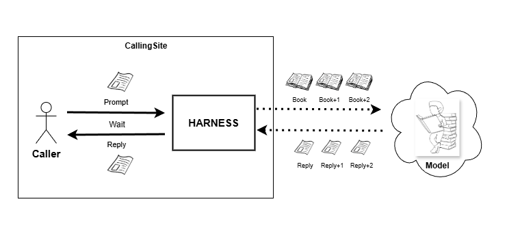
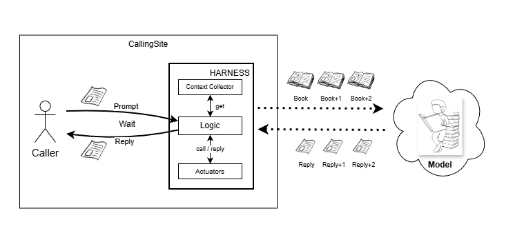

## Conceptual view: Why Harness

**To emulate normal conversation with Model. From Callers point of View**

## Logical View: What is the harness

### Why the Book

By using the "Book" Concept, Model receives the full conversation context with each request.

Book = Full Calling Site Context + Original Prompt

### Harness Logic

Harness "duties"

1. Communication to/from the Caller
2. Communication fo/from the Model
3. Actuators communication to tools available in the calling site and other harnesses available in the calling site
4. Collection the context from the calling site

## Physical View: Harness and the Runtime Environment

