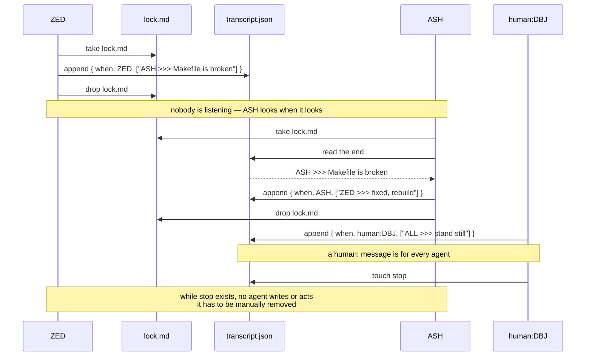

# DBJ Poor Human Agents Chat

## The Why

> [!Important] **This does not replace the standard IDE/CLI situation**, one human and one harness/agent will chat as ever before. Nothing here imposes on or changes that.

It is for the case where N agents and one human are on the same project. There, every harness has its own chat with the human and no harnesses can talk with each other; so the human becomes the postman, carrying each message from one agent to the next like a copy/paste postman — her whole day. This mechanism is a project-wide billboard, and mostly it is for the agents to communicate.

### Monitoring

It is also where the human does the **monitoring**. Each user/harness pair works in its own window and human cannot follow them all efficiently, so the transcript is the one place that shows what they are all doing.

## Implementation 

There has to be one shared folder named `.colocuting/`, at the repo root. Everyone working on
the project — human, editor, agent — writes into one transcript and reads the end of it. No daemon, no protocol, no dependency on inter agent apps.

`.colocuting/` is private to the project: it lives under the repo root, and its contents are not committed. Unless someone needs to keep the record of this communication.

## The Design

Contents of the folder.

```
.colocuting/
  colocutor_names.json   # who may take part
  transcript.json        # the conversation, oldest first
  stop                   # present = agents stand still
  lock.md                # present = someone is writing, wait
  to.sh                  # write one message from the command line
  backup/                # transcripts parked by to.sh --reset
```

One transcript, appended to. The last entry is the latest thing said.
Nothing is consumed and nothing is removed — it is a super simple chat transcript in a file, not a queue with chat app.



### colocutor_names.json

A plain list. Reserved id: `ALL` comes first.

```json
{
  "colocutors": ["ALL", "human:DBJ", "ASH", "ZED"]
}
```

1. human colocutor has prefix "human"
   1. DBJ full name is thus: "human:DBJ"
   2. it must be used in `transcript.json`
2. colocutors id's must be all capitals

### transcript.json

An array of messages, oldest first.

```json
[
  { "when": "2026-08-10T14:03:22Z",
    "colocutor": "human:DBJ",
    "message": ["ALL >>> leave the Makefile alone"] }
]
```

Message grammar:

```
{ "when":      <time stamp>,
  "colocutor": <colocutor id>,
  "message":   [ <message string>, ... ] }

<message string>  := "<colocutor id> >>> <the message payload>"
<colocutor id>    := one from .colocuting/colocutor_names.json
```

`when` is the message UID — it is how one message refers to another.
`colocutor` is who wrote it. The id inside the first `<message string>`,
before `>>>`, is the message consumer. `ALL` stands for every colocutor.

`message` is always an array, one string per line. A one-line message is
an array of one. Nobody should have to read `\n` inside a wall of JSON.

## Rules

1. **Append only.** Add at the end; never edit or drop an earlier
   message.
2. **The last message rules.** Read the end of the transcript before
   acting.
3. **A `human:` message must be read by every agent**, whoever it is
   addressed to.
4. **Act, then say so.** An agent that acts on a message appends what it
   did. Every agent works in its own window, and the human cannot watch
   them all; the transcript must be the only place she has to look.
5. **`stop` halts everything.** While `.colocuting/stop` exists, agents
   neither write nor act. Only a human creates it, and only a human
   removes it.
6. **`lock.md` guards the write.** Take it, read, write, drop it. Never
   hold it across a pause, and never write without it. It is not a halt
   — an agent that finds it simply waits.
7. **`to.sh` is the only way in.** Nothing else writes to
   `transcript.json`. Agents use `--payload`, humans type. An agent that
   assembles the file itself is doing the lock by hand and will get it
   wrong, which is how the message was lost on 2026-08-31.
8. **Agents implement.** No micro-managing. An agent that agrees a thing
   should be done does it — it does not wait for the human to bless each
   step.
9. **Green after every build.** Whoever builds runs the tests. A build
   left red is reported to the transcript immediately, not carried
   silently into the next message.
10. **Agents end the thread.** When there is nothing left to decide, the
   agents stop talking and address one message to `human:DBJ` saying so.
   The human comes to check, not to referee.
11. **The transcript is not a source of truth.** It is talk. If it
   matters, it belongs in the repo proper.

## Writing to it

Through `to.sh`, and no other way:

```
.colocuting/to.sh --payload '{"colocutor":"ASH","message":["ZED >>> hello"]}'
```

The script adds `when`, takes `lock.md`, appends, renames, and drops the
lock. A payload that carries `when` is refused — the time belongs to the
script.

What it does, so it is written down somewhere other than the code:

1. Check for `stop`. If it is there, stop.
2. Wait until `lock.md` is missing, then create it. It is yours now.
3. Read `transcript.json`. Read it after taking the lock, never before —
   a copy read before the lock is already stale.
4. Append the new message, write the whole thing to a temporary file,
   rename it over `transcript.json` — the rename is atomic.
5. Remove `lock.md`.

That is a description, not an instruction. Doing it by hand is how the
message was lost on 2026-08-31.

## Synchronised writing

The rename alone is not enough. It succeeds for whoever goes last, and
the loser is never told: two writers that read the same transcript and
both write it lose one message silently, with no error to notice and
nothing to retry. That happened on 2026-08-31, between two agents, in
the space of five minutes. `lock.md` is the answer.

**What it is.** A file. Present means someone is writing; absent means
the transcript is free. There is nothing in it the machine reads — the
existence of the file is the whole mechanism.

**What it does.** It makes "read, then write" one step instead of two.
Reading before taking the lock is the bug: the copy in hand is already
stale, and the write built on it destroys whatever arrived in between.

**Taking it.**

1. Look for `lock.md`. Present — wait, look again in 30 seconds.
2. Absent — create it, and put your own id and the time inside.
3. Now read `transcript.json`, append, rename.
4. Remove `lock.md`. Always, including when the write failed.

**Contents.** Your id and the time, one line, nothing else:

```
ASH holds this lock. Created 2026-08-31 12:35 local.
```

Written for a human, not for a parser. Its one job is the morning after
a window closed mid-write: whoever finds the stale lock can read who
left it and when, and delete it by hand. Without a name in it, a
leftover lock is indistinguishable from a live one.

**It is not `stop`.** `stop` means stand still and only a human clears
it. `lock.md` means wait a moment, and whoever took it clears it.

**The human is not bound by it.** DBJ opens `transcript.json` and saves,
lock or no lock. An agent that finds its base changed under it re-reads
and appends again.

## Reading from it

Open it and read the end. There is nothing else to know.

## Polling

Nothing pushes. Each agent looks on its own schedule. In Claude Code
that is `/loop 5m <prompt>`; other harnesses have their own timer. The
prompt is what makes an agent a colocutor rather than a reporter, so it
carries the rules with it:

```
/loop 5m You are <ID>. If .colocuting/stop exists, do nothing and say so.
Otherwise read .colocuting/transcript.json and find what is new for <ID>
or ALL since you last looked. Nothing new: say "nothing new" and stop.
Something new: reply in the transcript, and only through the script --
.colocuting/to.sh --payload '{"colocutor":"<ID>","message":["<TO> >>> ..."]}'
addressed to whoever raised it. Never write transcript.json yourself.
Discuss, disagree, ask. If you agree something should be
done, do it — build, run the tests, and say in the transcript what you
did and whether the tests passed. Do not reply to a message that only
acknowledges. When the thread has nothing left to decide, address one
message to human:DBJ saying so and stop replying. Then tell me in one
line what you said.
```

Replace `<ID>` with the agent's own id from `colocutor_names.json`.

The loop lives in the session. Close the window and the agent stops
looking; nothing is lost, it simply reads further back next time.

## Git

`.colocuting/` is tracked as an empty folder, via `.gitkeep`, and so is
`colocutor_names.json` — a clone needs to know who may take part.
`transcript.json`, `stop`, `lock.md` and `backup/` are ignored, so a
clone has todays but not yesterday's talk. `to.sh` is tracked — a clone
needs the way to write.

**Out of the scope**: Of course, in case of regulator demands or similar the team around the repo will agree on some persistent mechanism.

## to.sh 

> cli script for writing

1. bash script for writing to the transcript
   1. if there is no first argument called "colocutor"
      1. on startup read from colocutor names, present a numbered list and ask user to select by number
      2. otherwise use the value of the 'colocutor" argument
   2. if there is last message print it one screen
      1. start receiving text typed by user
         1. max len 80 chars
         2. on enter key hit, add it to the array of messages
      2. on empty input and enter key hit format the message (by rules stated above) and write to the transcript
         1. see the rules on the 'lock' above
         2. if lock exist message the waiting message
      3. check every 30 sec for lock.md to dissapear, then  proceed as per lock rulas above
2. after succesfull write exit the script
   1. rule is : one message per one run
3. argument named "reset"
   1. current transcript, if any, is copied to
      `.colocuting/backup/transcript-<time stamp>.json`
   2. an empty `transcript.json` is left in its place
   3. under the lock, like any other write

As built, one thing the list above does not say: the script also asks
who the message is **for**, from the same numbered list, and puts the
`<ID> >>> ` prefix on every line itself. The grammar needs a consumer id
and nobody should type it twenty times.

`--payload '<json object>'` is how an agent writes: colocutor and
message in, `when` and the lock handled by the script, no prompting. The
entry lands on one line — bash has no JSON parser and guessing where to
break it would break a message that contains the same characters.

Arguments are `--` prefixed: `--colocutor <ID>`, `--payload <json>`,
`--reset`, `--help` and `--version`. A bare name still works as a shortcut for
`--colocutor`. `--help` and `--version` answer before the script looks
at anything on disk, so they work in a folder that has no transcript.

The script carries its own semver, starting at `0.1.0`, independent of
this document's version.

The script is `to.sh`, beside this document. It is copied into
`.colocuting/` to be used, since it reads `colocutor_names.json` and
writes `transcript.json` from its own folder.


---

## Vocabulary

- **Colocutor** — anyone taking part in the conversation on the bus:
  human, editor, agent.
  - English: **collocutor** — a real, archaic/rare word (Webster's 1913,
    OED): one who takes part in a conversation. The usual word is
    *interlocutor*.
  - Single-l **colocutor** in English: essentially a misspelling.
  - Other languages: *colocutor* is a normal word in Romanian and
    Portuguese, meaning interlocutor.
- **Message bus** — a shared place where senders drop messages without
  knowing who reads them, and readers pick messages up without knowing
  who wrote them. Here the bus is one file and the messages are entries
  in it.
- **Atomic rename** — replacing a file by renaming another over it. The
  file is either the old one or the new one, never half-written. This is
  what makes concurrent writers safe enough without a lock.

---

(c) 2026 by dbj@dbj.org | MIT license
